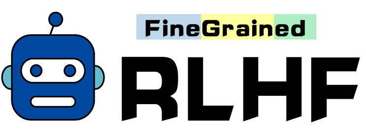

<p align="center">
  
</p>

<h1 align="center"> Fine-Grained RLHF </h1>

This repo provides data, code and models for the paper: [Fine-Grained Human Feedback Gives Better Rewards for Language Model Training](https://arxiv.org/pdf/2306.01693.pdf).

## Content
1. [Set Up](#set-up)
2. [Tasks and Data](#tasks-and-data)
    * [Long-form QA](#long-form-qa)
    * [Detoxification](#detoxification)
3. [SFT Training](#sft-training)
4. [Reward Modeling](#reward-modeling)
5. [RLHF Training](#rlhf-training)
    * [Holistic RLHF](#holistic-rlhf)
    * [Fine-Grained RLHF](#fine-grained-rlhf)
6. [Our Trained Models](#our-trained-models)
7. [Feedback Collection Interfaces](#feedback-collection-interfaces)


## Set Up
```bash
# create a conda environment with python 3.9
conda create --name py39 python=3.9
conda activate py39 

# git clone and install packages
git clone https://github.com/allenai/FineGrainedRLHF.git
cd FineGrainedRLHF
pip install -e .
python -m spacy download en_core_web_sm
```

## Tasks and Data

### Long-form QA
Long-form QA requires an LM to generate a textual response to a question with comprehensive answers and explanations. We conduct experiments on our constructed data, qa-feedback, with collected preference-based and fine-grained human feedback. Please see the data under `./tasks/qa_feedback/data`.

### Detoxification
The task of detoxification aims to reduce the toxicity in the model generation y when given a prompt x. We conduct experiments on [RealToxicityPrompts](https://allenai.org/data/real-toxicity-prompts).

## SFT Training
All our experiments reported in the paper were run on 80G A100 GPUs.

For qa-feedback, we initialize the policy model with supervised finetuning on 1K training examples, by running the following command. The trained model is saved under `./tasks/qa_feedback/model_outputs/t5-large-1k-train`.

```bash
bash tasks/qa_feedback/training/train_sft.sh
```

We do not do supervised finetuning for the detoxification task and simply use GPT-2 as the initial policy model.

## Reward Modeling
For qa-feedback, we train three fine-grained reward models R1, R2 and R3 that correspond to (1) irrelevance, repetition, and incoherence error and (2) incorrect or unverifiable facts and (3) information completeness:

```bash
# prepare RM training data, all data saved under ./tasks/qa_feedback/data
bash tasks/qa_feedback/reward_modeling/create_rm_train_files.sh

# train R1, saved under ./tasks/qa_feedback/model_outputs/rel_rm
bash tasks/qa_feedback/reward_modeling/train_rel_rm.sh

# train R2, saved under ./tasks/qa_feedback/model_outputs/fact_rm
bash tasks/qa_feedback/reward_modeling/train_fact_rm.sh

# train R3, saved under ./tasks/qa_feedback/model_outputs/comp_rm
bash tasks/qa_feedback/reward_modeling/train_comp_rm.sh
```

To train the preference-based reward model:

```bash
bash tasks/qa_feedback/reward_modeling/train_baseline_rm.sh
```

For detoxification, as explained in the paper, we use [PERSPECTIVE](https://github.com/conversationai/perspectiveapi), an off-the-shelf toxicity API as our reward model.

## RLHF Training
We provide training scripts to run both holistic and fine-grained RLHF. Now we only provide the scripts for qa-feedback, and will add those for the detoxification task soon. 

You can find the hyperparameters in `tasks/{task_name}/training/baseline_config.yml` and `tasks/{task_name}/training/fine_grained_config.yml` and change them accordingly. For example, you may want to change `wandb_entity` as your own wandb username. 

You also want to change the `mean` and `std` values for sequence-level reward models (preference and info completeness) in each yml file, which stand for the mean and average reward scores on the training data from the reward model. You can find the values from the `mean_std.txt` file under `./tasks/qa_feedback/model_outputs/comp_rm` or `./tasks/qa_feedback/model_outputs/baseline_rm`. The current values are from our own trained reward models.

### Holistic RLHF

For qa-feedback:
```bash
bash tasks/qa_feedback/training/train_baseline.sh
```

### Fine-Grained RLHF

For qa-feedback:
```bash
bash tasks/qa_feedback/training/train_finegrained.sh
```

## Our Trained Models

Please find our trained SFT, reward and RLHF models from [this link](https://drive.google.com/drive/folders/18EBBOlePyh86tsTPNeCiImKkbGqN48A7?usp=sharing). Place the unzipped folders inside the `./task/{task_name}/model_outputs` folder and run the scripts above that depend on these models accordingly. For example, you can run the RLHF experiments directly after downloading and placing our reward model folders.


## Feedback Collection Interfaces

We provide html files for feedback collection interfaces of qa-feedback. Please find them under `tasks/qa_feedback/interface_html`. Open `templates/annotation.html` and `templates/comparison.html` in a browser to view the interface for fine-grained and preference feedback collection, respectively.

## Citation
```
@article{wu2023fine,
  title={Fine-Grained Human Feedback Gives Better Rewards for Language Model Training},
  author={Wu, Zeqiu and Hu, Yushi and Shi, Weijia and Dziri, Nouha and Suhr, Alane and Ammanabrolu, Prithviraj and Smith, Noah A and Ostendorf, Mari and Hajishirzi, Hannaneh},
  journal={arXiv preprint arXiv:2306.01693},
  year={2023}
}
```
